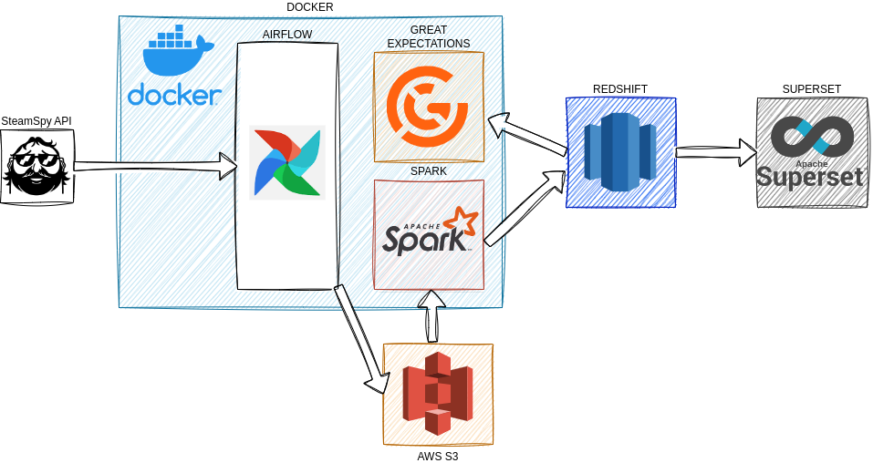
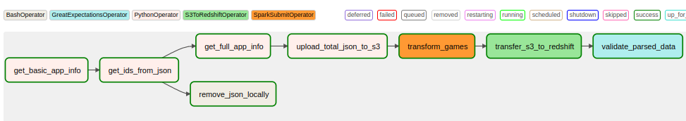
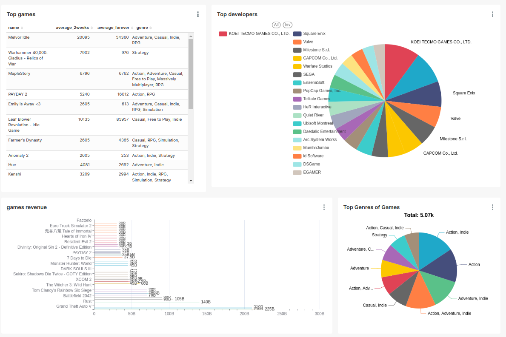
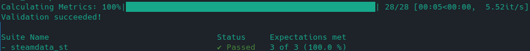

# Description

The Steam is a digital distribution service for video games, providing a vast library of games, community features, and social interaction for gamers worldwide. SteamSpy is a website that provides estimated sales and player data for games on the Steam platform, offering insights into their popularity and performance. It has an API. This project is basically fetches data from SteamSpy, stores it in DB and makes dashboard with charts. 


# Technologies used
Following tools were used to make this project real:
* Orchestration: Apache Airflow
* Warehousing: AWS Redshift
* Storage: AWS S3
* Processing: Apache Spark. Scala
* Data Quality Assurance: Great Expectations
* Containerization: Docker
* Data Visualization: Apache Superset

The project utilizes a customized version of the Airflow docker compose file, incorporating two Spark services from the [bitnami Spark image](https://hub.docker.com/r/bitnami/spark/).

Furthermore, the pipeline relies on the modules specified in the [requirements.txt](requirements.txt) file to fulfill its functional requirements.

# Architecture

This project consists of two parts: local and cloud. Local system is deployed via Docker, which consists of Airflow and Spark (and PostgreSQL for AF). Cloud system (S3, IAM, Redshift) is deployed with Terraform.



AirFlow daily obtains information of 13000 games and stores them in json in S3. After that Apache Spark performs some transformations with UDF (changing language names ('English' -> 'EN'), since Redshift column is limited by 255 symbols) and saves DataFrame as a parquet file on S3.



After that Great Expectations validates data. This ensures we can reliably make some analytics on that data.



# Installation
1. Download and install:
    * Docker, docker compose
    * Scala, sbt
2. Clone repo locally.
3. Create image for Apache Airflow:
```
docker build -f Dockerfile.Airflow . -t airflow-spark 
```
4. Create image for Apache Spark:
```
docker build -f Dockerfile.Spark . -t spark-air  
```
5. Compile all scala files with Apache Spark code, move it to directory where Airflow looks for them and additionally download jars to make Spark working with AWS:
```
sh setup.sh
```
# Usage
When installation is complete, you can run `docker compose` to start Airflow and Spark.

Next, you sould create AWS IAM account with all necessary permissions (creating IAM users (for Redshiift), manage S3 and Redshift). AWS_ACCESS_KEY_ID and AWS_SECRET_ACCESS_KEY of your main IAM user should be added to Airflow variables via Airflow GUI. 

Also you have to create separate connections for Spark, AWS and AWS Redshift.

To create S3 bucket and AWS Redshift cluster proceed to `terraform` folder and run following commands (it may take saveral minutes in third command):
```
terraform init
terraform plan
terraform apply
```
# Data validation

Since data is already in decent quality i have decided to make light check and see whether data in appropriate range\category



# Limitations and Future work

SteamSpy also have an API for steam reviews, one of possible improvements for a project can be imprementing of some NLP based on text analysis of obtained data. 

Implementing of SCD type 2 would be another way of improvement for a project. This would allow us to track changes in online number for games, or whether some games were on giveaways (sudden spike of owners) etc.